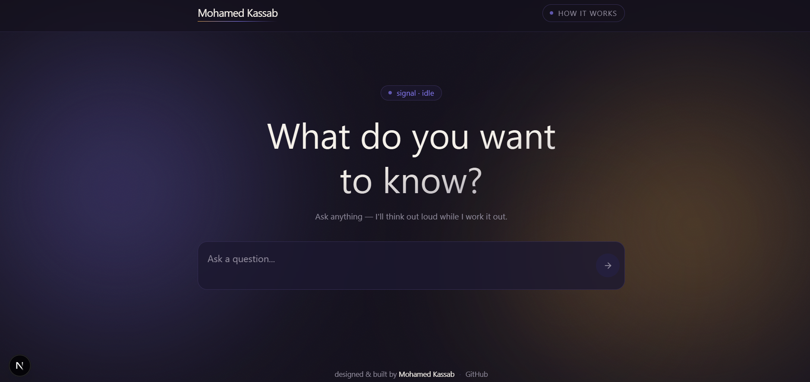

<div align="center">

# 🔮 Signal

**A streaming AI agent that thinks in steps, out loud.**

Built with LangChain, FastAPI, and Next.js — from scratch, no `AgentExecutor` shortcuts.


<br>



</div>

---

## ✨ Overview

Signal is a full-stack AI agent application. Instead of just calling an LLM and waiting for a full response, it streams the agent's reasoning **token by token** — showing exactly which tool it's using, why, and what it found, before it commits to a final answer.

Rather than relying on LangChain's built-in `AgentExecutor`, this project implements a **custom agent loop from scratch**: manual tool-calling, manual streaming via callbacks and an `asyncio.Queue`, and manual reasoning-step tracking. The goal was to understand — and be able to explain — every layer of how an LLM agent actually works, not just import one.

## 🚀 Features

- **Custom agent loop** — a hand-built `CustomAgentExecutor` that iteratively calls the LLM, executes tools, and feeds results back until it reaches a final answer (with a max-iteration safety limit)
- **True token streaming** — responses are streamed live from OpenAI through FastAPI to the browser via Server-Sent Events, not faked by chunking a finished response
- **Tool-calling agent** — the model decides for itself whether to do arithmetic, search the web, or answer directly
- **Live reasoning trace** — the UI shows each tool call as it happens, then resolves into a final, formatted answer
- **Concurrent tool execution** — multiple tool calls in a single step run in parallel with `asyncio.gather`, not sequentially

## 🧱 Tech stack

| Layer | Technology |
|---|---|
| LLM orchestration | LangChain (LCEL), OpenAI `gpt-4o-mini` |
| Backend | FastAPI, Python, `asyncio` |
| Web search tool | SerpAPI |
| Frontend | Next.js, React, TypeScript, Tailwind CSS |
| Streaming transport | Server-Sent Events (SSE) |

## 🏗️ Architecture

```
Browser (Next.js)
   │  POST /invoke
   ▼
FastAPI (agent.py / main.py)
   │
   ▼
CustomAgentExecutor  ──▶  OpenAI API (gpt-4o-mini)
   │        │
   │        └────────────▶ SerpAPI (web search)
   │
   ▼
Streamed tokens ──▶ Server-Sent Events ──▶ Browser (live render)
```

<details>
<summary><strong>🔍 How a request flows (click to expand)</strong></summary>
<br>

1. The user submits a question from the browser.
2. FastAPI opens a streaming connection and hands the question to `CustomAgentExecutor`.
3. The agent asks the LLM what to do. The LLM responds with a tool call (math, web search) or a `final_answer`.
4. If a tool was called, it executes, and the result is added to the agent's scratchpad — then the loop repeats.
5. Once `final_answer` is called, the loop ends and the answer streams back to the browser token by token.

</details>

## ⚡ Getting started

### Prerequisites

- Python 3.12+
- Node.js 18+
- An [OpenAI API key](https://platform.openai.com/api-keys)
- A [SerpAPI key](https://serpapi.com/)

### Backend setup

```bash
cd api
python -m venv venv
.\venv\Scripts\Activate.ps1        # Windows
# source venv/bin/activate         # macOS/Linux

pip install fastapi uvicorn langchain langchain-openai langchain-core langchain-community aiohttp pydantic python-dotenv google-search-results
```

Create a `.env` file inside `api/`:

```
OPENAI_API_KEY=your-openai-key-here
SERPAPI_API_KEY=your-serpapi-key-here
```

Run the backend:

```bash
uvicorn main:app --reload
```

The API is now live at `http://localhost:8000`.

### Frontend setup

```bash
cd app
npm install
npm run dev
```

The app is now live at `http://localhost:3000`.

## 📁 Project structure

```
ai-agent-capstone/
├── api/
│   ├── agent.py        # Agent logic: prompt, tools, streaming, custom executor
│   ├── main.py          # FastAPI app and the /invoke endpoint
│   └── .env              # API keys (not committed)
├── app/
│   └── src/
│       ├── app/            # Pages, layout, global styles
│       └── components/     # Header, TextArea, Output, HowItWorks
└── assets/
    └── demo.png          # Screenshot used in this README
```

## 🗺️ Roadmap

- [ ] Persistent chat history (currently in-memory only)
- [ ] User authentication
- [ ] Migrate to LangGraph for more robust agent orchestration
- [ ] Add more tools (calculator with unit conversion, code execution)
- [ ] Deploy to production (Vercel + Railway/Render)

## 🙏 Acknowledgements

Built while working through [Aurelio Labs' LangChain course](https://github.com/aurelio-labs/langchain-course), then extended and customized end to end — UI, branding, and functionality.

## 👤 Author

**Mohamed Kassab**
Final-year AI student · transitioning into AI Engineering

[GitHub](#) · [LinkedIn](#)
